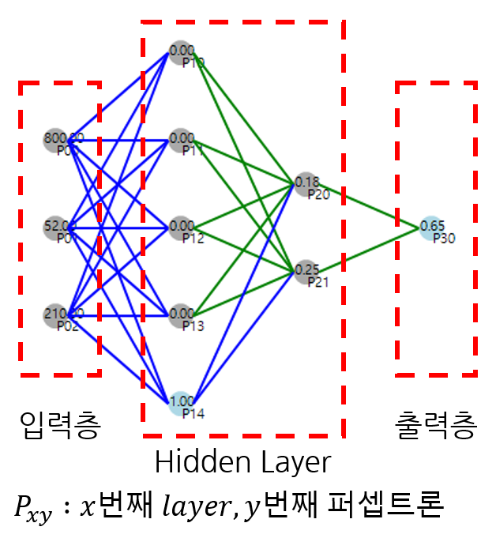

# FlappyBird_GA_ANN
유전 알고리즘(GA - Genetic algorithm)을 이용해 플래피 버드(Flappy Bird) 게임을 학습하는 다중 레이어 퍼셉트론 신경망(MLP neural network) 구현


**구현 영상**

[](http://www.youtube.com/watch?v=QU11EOXkaB4)


## 0. 그대로 실행 시 주의사항
그대로 실행 시, 하위 디렉토리 ```\datas``` 를 생성하고 학습 내용에 대해 모두 저장하도록 되어 있습니다.
수많은 파일을 생성하고 싶지 않다면, ```GA_ANN.cs``` 에서 ```DNASimul()```와 ```GetScores()``` 함수를 수정하세요.

## 1. Flappy Bird 게임 Class 구현


**주인공(플레이어)** : 빨간색 사각형

**주인공 행동** : 위로 점프

**장애물** : 파란색 사각형

**패배 조건** : 주인공이 장애물과 접할 경우

**점수** : 생존 시간에 비례

## 2. MLP (Mulilayer perceptron) 신경망 구조 설계


### 2.1. 입력 레이어

**P00** : 다음 장애물과의 거리

**P01** : 다음 장애물의 입구 높이와의 거리 차이

**P02** : 주인공(플레이어)의 y좌표(높이)


### 2.2. 은닉 레이어(Hidden Layer)

2중 Layer로 구성 (5 + 2)


### 2.3. 출력 레이어

**P30** : Jump여부 (0.5이상 값이면 점프)

## 3. 유전 알고리즘(Genetic algorithm) 설계

### 3.1. DNA 구조 설계

각 퍼셉트론에 대한 weight 값과 bias값의 배열


### 3.2. DNA 개수
총 20개

### 3.3. 돌연변이 확률
5%

### 3.4. 교배 규칙

**1)** 게임 점수 상위 50% DNA보존

**2)** 하위 50% DNA는 상위 50% 교배 DNA로 교체

**3)** 상위 50% DNA교배 시, 점수에 비례해 유전 인자 결정
